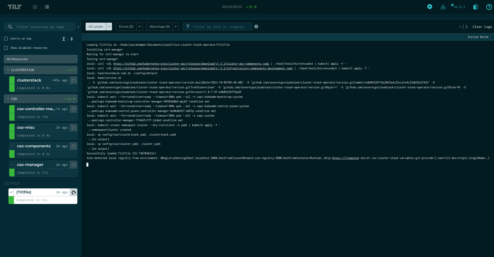

# Cluster Stack Operator

## Get started

The Cluster Stack Operator works with [Cluster Stacks](https://github.com/SovereignCloudStack/cluster-stacks) and creates Kubernetes clusters in an easy and [Cluster-API](https://github.com/kubernetes-sigs/cluster-api)-native way.

The operator can be used with any repository that contains releases of cluster stacks. For more details of how to implement them, have a look at the [cluster-stacks repository](https://github.com/SovereignCloudStack/cluster-stacks).

To try out this operator and cluster stacks, have a look at this [demo](https://github.com/SovereignCloudStack/cluster-stacks-demo).

## What is the Cluster Stack Operator?

The Cluster Stack Operator facilitates the manual work that needs to be done to use cluster stacks. 

There are three components of a cluster stack:

1. Cluster addons: The cluster addons (CNI, CSI, CCM) have to be applied in each workload cluster that the user starts
2. Cluster API objects: The `ClusterClass` object makes it easier to use Cluster-API. The cluster stack contains a `ClusterClass` object and other Cluster-API objects that are necessary in order to use the `ClusterClass`. These objects have to be applied in the management cluster.
3. Node images: Node images can be provided to the user in different form. They are released and tested together with the other two components of the cluster stack.

The first two are handled by this operator here. The node images, on the other hand, have to be handled by separate provider integrations, similar to the ones that [Cluster-API uses](https://cluster-api.sigs.k8s.io/developer/providers/implementers-guide/overview).

## Implementing a provider integration

Further information and documentation on how to implement a provider integration will follow soon.

## Developing Cluster Stack Operator

Developing our operator is quite easy. First, you need to install some base requirements: Docker and Go. Second, you need to configure your environment variables. Then you can start developing with the local Kind cluster and the Tilt UI to create a workload cluster that is already pre-configured. 

## Setting Tilt up
1. Install Docker and Go. We expect you to run on a Linux OS.
2. Create an ```.envrc``` file and specify the values you need. See the .envrc.sample for details.

## Developing with Tilt

<p align="center">

</p> 

Operator development requires a lot of iteration, and the “build, tag, push, update deployment” workflow can be very tedious. Tilt makes this process much simpler by watching for updates and automatically building and deploying them. To build a kind cluster and to start Tilt, run:

```shell
make tilt-up
```
> To access the Tilt UI please go to: `http://localhost:10350`


You should make sure that everything in the UI looks green. If not, e.g. if the clusterstack has not been synced, you can trigger the Tilt workflow again. In case of the clusterstack button this might be necessary, as it cannot be applied right after startup of the cluster and fails. Tilt unfortunately does not include a waiting period.

If everything is green, then you can already check for your clusterstack that has been deployed. You can use a tool like k9s to have a look at the management cluster and its custom resources. 

In case your clusterstack shows that it is ready, you can deploy a workload cluster. This could be done through the Tilt UI, by pressing the button in the top right corner "Create Workload Cluster". This triggers the `make create-workload-cluster-docker`, which uses the environment variables and the cluster-template.

In case you want to change some code, you can do so and see that Tilt triggers on save. It will update the container of the operator automatically.

If you want to change something in your ClusterStack or Cluster custom resources, you can have a look at `.cluster.yaml` and `.clusterstack.yaml`, which Tilt uses.

To tear down the workload cluster press the "Delete Workload Cluster" button. After a few minutes the resources should be deleted. 

To tear down the kind cluster, use:

```shell
$ make delete-bootstrap-cluster
```

If you have any trouble finding the right command, then you can use `make help` to get a list of all available make targets. 

## Troubleshooting

Check the latest events:

```shell
kubectl get events -A  --sort-by=.lastTimestamp
```

Check the conditions:

```shell
go run github.com/guettli/check-conditions@latest all 
```

Check with `clusterctl`:

```shell
clusterctl describe cluster -n cluster my-cluster
```

Check the logs. List all logs from all deployments. Show the logs of the last ten minutes:

```shell
kubectl get deployment -A --no-headers | while read -r ns d _; do echo; echo "====== $ns $d"; kubectl logs --since=10m -n $ns deployment/$d; done
```
