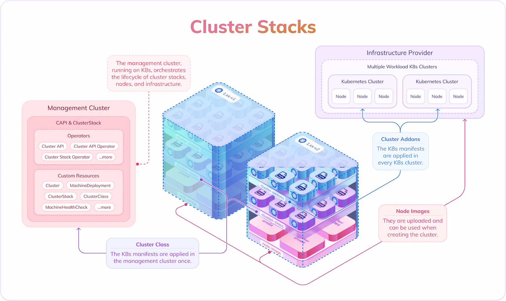

# Overview

## Architecture

## Cluster stacks

The cluster stacks are opinionated templates of clusters in which all configuration and all core components are defined. They can be implemented on any provider.

There can be multiple cluster stacks that acknowledge the many ways in which a cluster can be set up. There is no right or wrong and cluster stacks make sure that the flexibility is not lost.

At the same time, they offer ready-made templates for users, who do not have to spend a lot of thought on how to build clusters so that everything works well together.

Cluster stacks are implemented by two Helm charts. The first one contains all Cluster API objects and is applied in the management cluster. The second Helm chart contains the cluster addons, i.e. the core components every cluster needs, and is installed in the workload clusters.

Furthermore, there are node images that can look quite different depending on the provider.

To sum up, there are three components of a cluster stack:

1. Cluster addons: The cluster addons (CNI, CSI, CCM) have to be applied in each workload cluster that the user starts
2. Cluster API objects: The `ClusterClass` object makes it easier to use Cluster-API. The cluster stack contains a `ClusterClass` object and other Cluster-API objects that are necessary in order to use the `ClusterClass`. These objects have to be applied in the management cluster.
3. Node images: Node images can be provided to the user in different form. They are released and tested together with the other two components of the cluster stack.

More information about cluster stacks and their three parts can be found in https://github.com/SovereignCloudStack/cluster-stacks/blob/main/README.md.

## Cluster Stack Operator

The Cluster Stack Operator takes care of all steps that have to be done in order to use a certain cluster stack implementation.

It has to be installed in the management cluster and can be interacted with by applying custom resources. It extends the functionality of the Cluster API operators.

The Cluster Stack Operator mainly applies the two Helm charts from a cluster stack implementation. It is also able to automatically fetch a remote Github repository to see whether there are new releases of a certain cluster stack.

The first and second component of a cluster stack are handled by the Cluster Stack Operator.

The node images, on the other hand, have to be handled by separate provider integrations, similar to the ones that [Cluster-API uses](https://cluster-api.sigs.k8s.io/developer/providers/implementers-guide/overview).

## Cluster Stack Provider Integrations

The Cluster Stack Operator is accompanied by Cluster Stack Provider Integrations. A provider integration is also an operator that works together with the Cluster Stack Operator in a specific way, which is described in the docs about building [provider integrations](../develop/provider-integration.md).

A provider integration makes sure that the node images are taken care of and made available to the user.

If there is no work to be done for node images, then the Cluster Stack Operator can work in `noProvider` mode and this Cluster Stack Provider Integration can be omitted.

## Steps to make cluster stacks ready to use

There are many steps that are needed in order to make cluster stacks ready to use. In order to understand the full flow better and to get an idea of how much work there is and how many personas are involved, we will give an overview of how to start from scratch with a new cluster stack and provider.

We will assume that this operator exists, but that you want to use a new cluster stack and provider.

### Defining a cluster stack

First, you need to define your cluster stack. Which cluster addons do you need? How do your node images look like? You need to take these decisions and write them down.

### Implementing a cluster stack

The next step is to implement your cluster stack for your provider. You can take existing implementations as reference, but need to think of how the provider-specific custom resources are called and how the respective Cluster API Provider Integration works.

### Implementing a Cluster Stack Provider Integration

We assume that you need to do some manual tasks in order to make node images accessible on your provider. These steps should be implemented in a Cluster Stack Provider Integration, which of course has to work together with the details of how you implemented your cluster stack.

### Using everything

Finally, you can use the new cluster stack you defined and implemented on the infrastructure of your provider. Enjoy!
